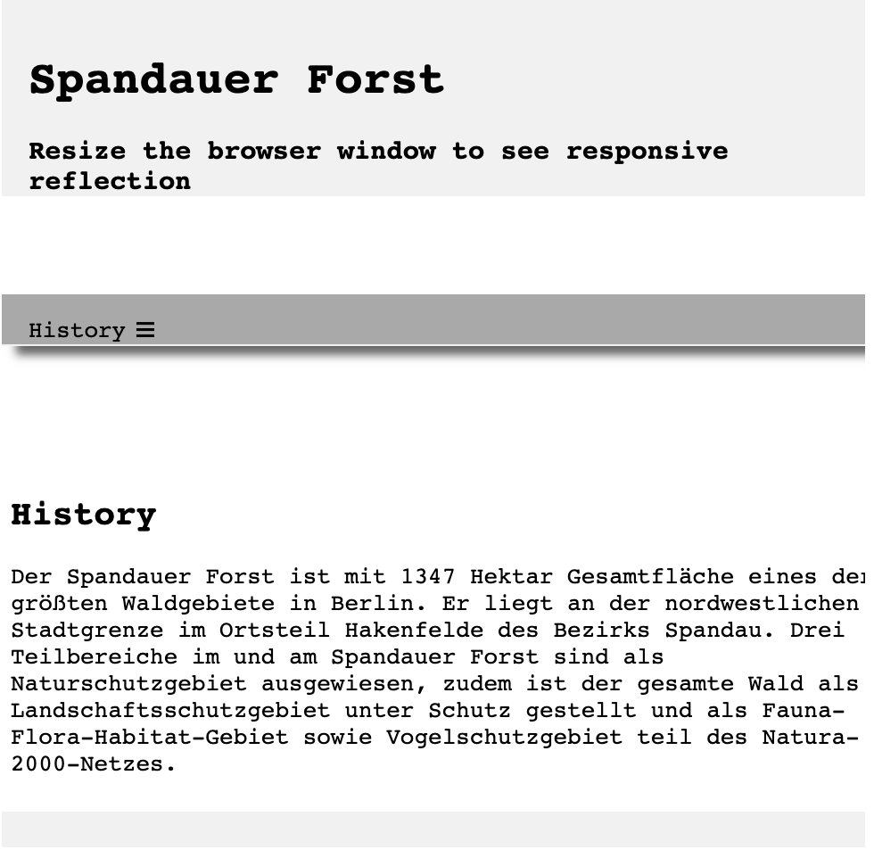

# This repo represents some basic responsive web ui 

1. with html and css ([demo click here](https://xs-hua.github.io/responsive-webui/index-01.html))

- on desktop screen

- on mobile phone screen

